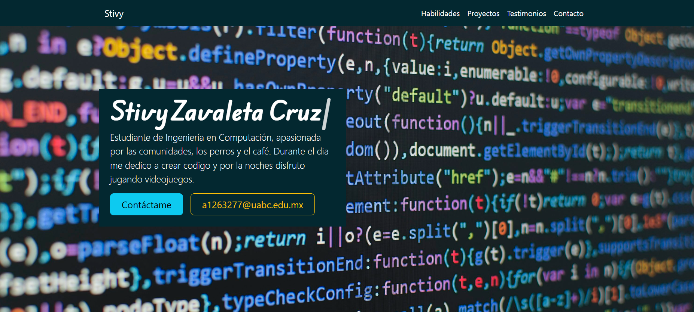
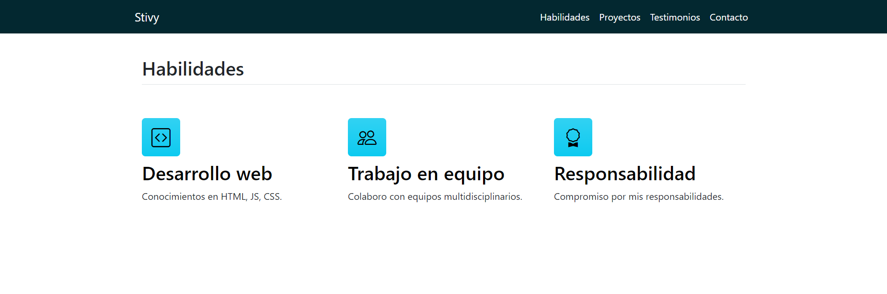
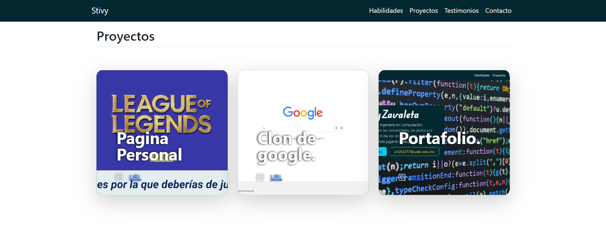
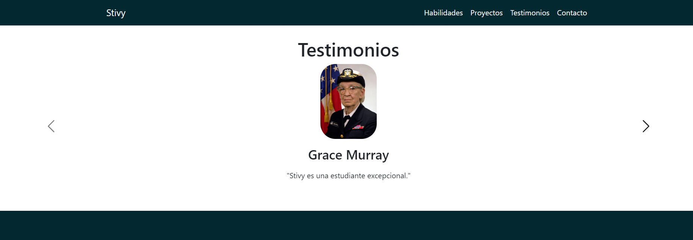
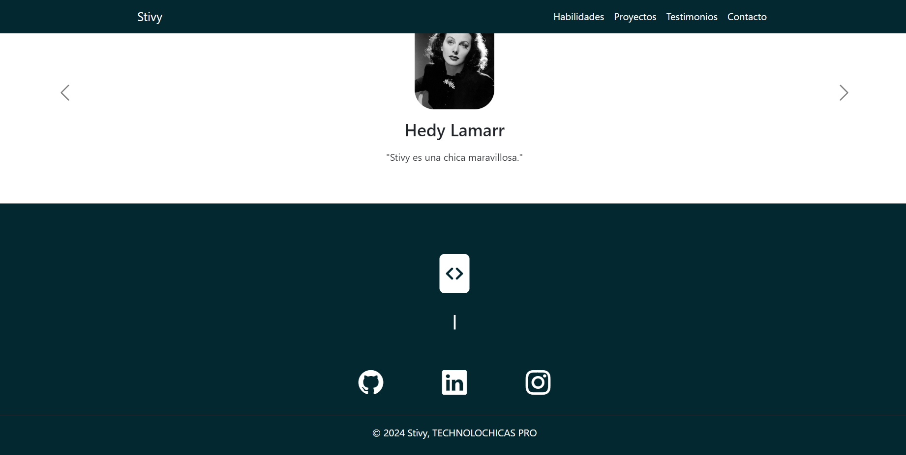

# Mi portafolio de habilidades TECNOLOCHICAS PRO

El presente proyecto es un portafolio desarrollado para poner en practica las habilidades obtenidas dentro del bootcamp de desarrollo frontend de TECNOLOCHICAS PRO

Fue desarrollado con HTML, CSS Y JS con el uso del framework de UI, Bootstrap utilizando bibliotecas externas.

La página es responsiba (adaptable a diferentes tamaños de pantalla) e incluye la presentación de la autora del proyecto

Proyecto desplegado: proximamente

## Secciones de mi sitio

## Tecnologías

* HTML
* CSS
* Bootstrap
* JavaScript

---

Desarrollado con   por [Stivy](https://github.com/StivyZavaleta/) en [TECNOLOCHICAS](https://tecnolochicas.mx/)
